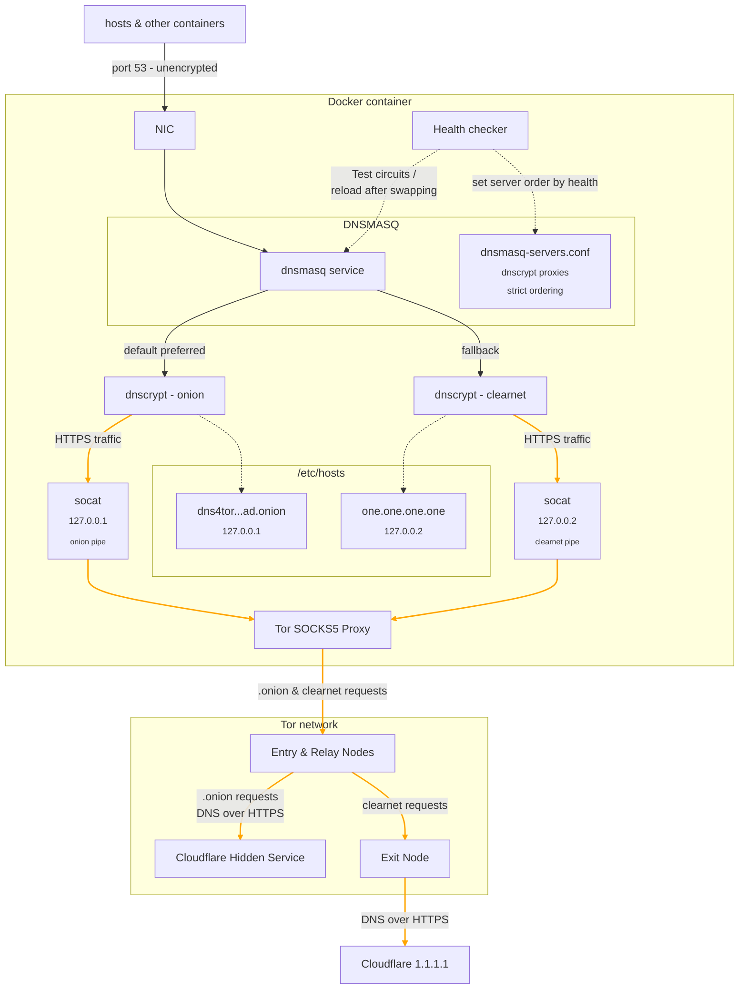

Making DNS private AND anonymous.
A DNS proxy that prioritizes Cloudflares Tor hidden resolver and automatically fails over to clearnet DoH over Tor, with health-based routing and metrics monitoring. Set up is easy and privacy is extremely strong. Designed for users who want to hide DNS activity from ISPs and resolvers, and reduce linkability between queries and identity.

Testimonials:
"I've used moleDNS for 2 years in production and have zero downtime!" - Guy who made it

## wishlist

- [ ] Support for encrypted connections to the container (DoT, DoH)
- [ ] Add nyx support
- [ ] Pass through more docker env variables for advanced configuration
- [ ] Performance optimizations

## Priorities

This mission of this project is to provide an ***easy***, out-of-the-box solution that anyone can run to have the ultimate in DNS privacy

# Why?

DNScrypt is a great way to shield your DNS queries from your ISP and other on-path entities, but it still requires you to trust the resolvers themselves. Privacy is possible, but anonymity is not.
This solution assumes resolvers cannot be trusted. In the age of big data and AI, why trust a resolver? With moleDNS the resolvers no longer see your IP. In extreme cases, advanced techniques like heuristics to reveal who you are based on your queries, or timing attacks, are still possible.

# Getting Started

1. Clone this repo, or download it.
2. Make sure you've installed Docker Desktop
3. In the project folder, run `docker compose up`, or `docker compose up -d` to run in the background
4. Your DNS server is now available at 127.0.0.1 on port 6053

# Considerations

### Performance

Latency is generally under 300ms, and does not disrupt regular services. Acceptable for most use cases, with caching mitigating most query overhead.

### hostname visible in request

Without Encrypted Client Hello (ECH), the destination hostname is still exposed via SNI during the TLS handshake, which can reduce or eliminate the privacy gains of encrypted DNS, especially against on path observers like ISPs. DNS encryption still prevents DNS level monitoring, but SNI can reveal the same hostname later in the connection.

### IP correlation
Small or self-hosted websites will have IPs that make it pretty easy to guess what site you're visiting. Larger providers will have many hostnames behind the IPs they serve, so privacy is preserved more easily when accessing sites hosted on these platforms.

## Technical Notes

### HTTPS
Tor exit nodes are not to be trusted; whoever controls one unwraps the final layer of encryption in a connection, so HTTPS must be used.
This requires the hosts file to bind hostnames for the DNS servers directly to the socat instance its targeting, this ensures when the https pipe for socat sends back the certificate that cloudflare provides it can show the same hostname that dnscrypt proxy attempted to start the connection with, since IP addresses are not possible (we connect to socat on the loopback, not 1.1.1.1).

